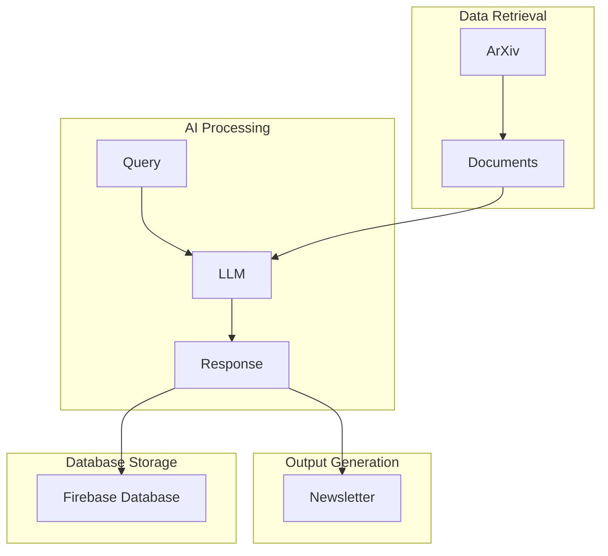

# MedDigest

MedDigest is a tool that automatically collects and processes medical research papers from various open repositories, including arXiv's medical and quantitative biology sections. It extracts key findings, methods, and emerging keywords to help researchers stay up-to-date with the latest developments in medical research.

## Features

- Fetches medical papers from arXiv's API
- Extracts paper metadata including:
  - Title and paper ID
  - Publication date
  - Authors
  - Abstract
  - Full text link
- Processes papers from the last 7 days
- Handles API rate limiting and connection issues
- **NEW**: Stores paper analyses to Firebase Firestore database
- **NEW**: Retrieves and queries stored analyses by specialty, interest score, and other criteria
- Provides structured output for further analysis

## Architecture



## Database Storage

MedDigest now automatically stores paper analyses to Firebase Firestore when papers are processed. Each analysis includes:

- Paper metadata (title, authors, publication date, categories)
- AI-generated specialty classification
- Extracted keywords and focus areas
- Interest score and detailed scoring breakdown
- Timestamp of when the analysis was stored

### Database Operations

The system provides several ways to query stored analyses:

- **By Paper ID**: Retrieve analysis for a specific paper
- **By Specialty**: Get all papers in a medical specialty (e.g., Cardiology, Oncology)
- **By Interest Score**: Find high-interest papers (score ≥ 7.0)
- **By Score Range**: Get papers within a specific interest score range

### Usage Examples

```python
from utils.database_utils import DatabaseUtils

# Initialize database utilities
db_utils = DatabaseUtils()

# Get high-interest papers
high_interest = db_utils.get_high_interest_papers(min_score=8.0, limit=10)

# Get papers by specialty
cardiology_papers = db_utils.get_analyses_by_specialty("Cardiology", limit=20)

# Get papers in score range
mid_range = db_utils.get_papers_by_score_range(6.0, 8.0, limit=15)

# Get specific paper analysis
analysis = db_utils.get_paper_analysis("paper_id_here")
```

## Requirements

- Python 3.x
- Required Python packages:
  - requests
  - xml.etree.ElementTree
  - firebase-admin
  - langchain-groq
  - python-dotenv

## Environment Setup

1. Create a `.env` file in the project root with the following variables:

```env
GROQ_API_KEY=your_groq_api_key_here
FIREBASE_PROJECT_ID=your_firebase_project_id
FIREBASE_SERVICE_ACCOUNT_PATH=path/to/serviceAccountKey.json
```

2. Set up Firebase:
   - Create a Firebase project
   - Enable Firestore database
   - Download service account key and save as `serviceAccountKey.json`
   - Update the path in your `.env` file

## Usage

1. Navigate to the project directory:
```bash
cd MedDigest
```

2. Run the main script:
```bash
python3 main.py
```

3. Test database functionality:
```bash
python3 test_database_storage.py
```

4. Use database utilities:
```bash
python3 utils/database_utils.py
```

The script will fetch medical papers from the last 7 days, analyze them with AI, store the analyses to the database, and generate a newsletter.

## Database Schema

### Paper Analyses Collection (`paper_analyses`)

Each document represents a paper analysis with the following fields:

- `paper_id` (string): Unique arXiv paper identifier
- `title` (string): Paper title
- `authors` (array): List of author names
- `categories` (array): arXiv categories
- `published` (timestamp): Publication date
- `specialty` (string): AI-classified medical specialty
- `keywords` (array): Extracted key terms
- `focus` (string): Paper's main focus area
- `interest_score` (number): AI-generated interest rating (0-10)
- `score_breakdown` (object): Detailed scoring components
- `stored_at` (timestamp): When analysis was stored

## Future Enhancements

- Integration with additional medical research repositories
- Advanced text analysis for key findings extraction
- Keyword extraction and trend analysis
- PDF download and processing capabilities
- Web interface for browsing results
- Real-time analysis updates and notifications
- Advanced analytics and trend reporting

## Contributing

Feel free to submit issues and enhancement requests!
