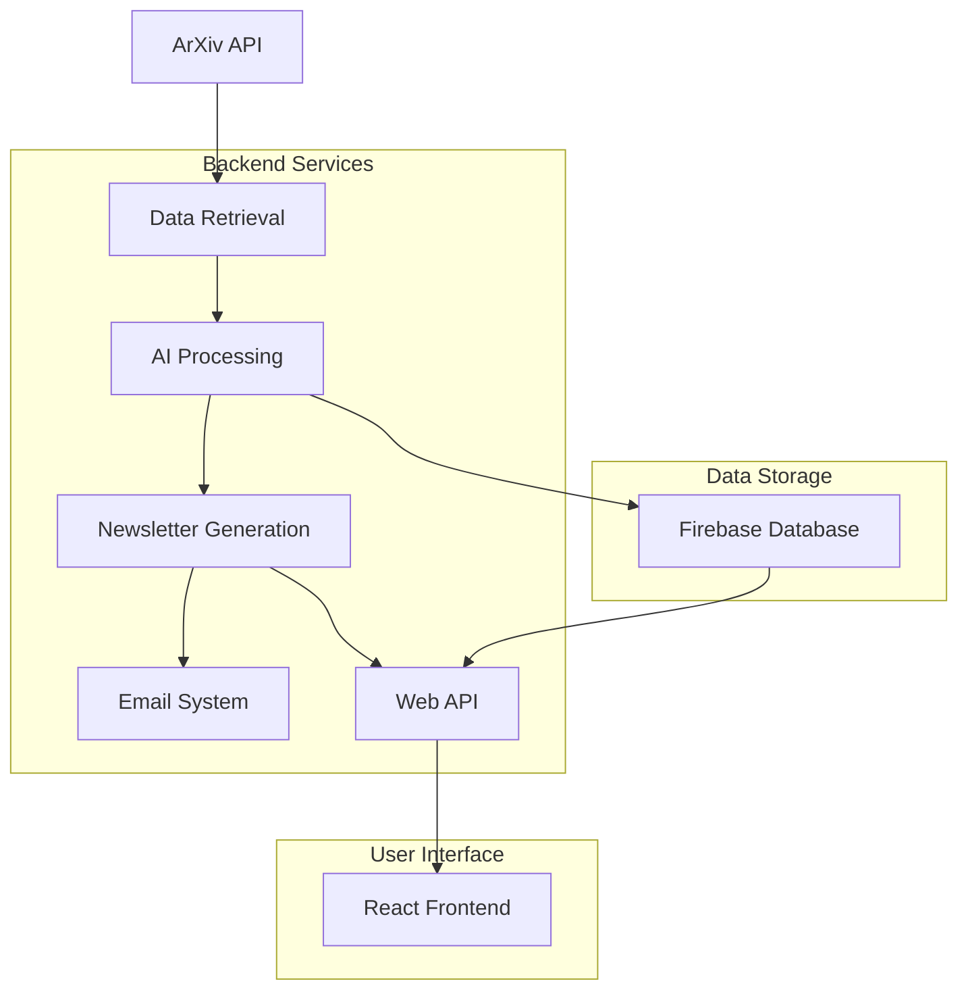

# MedDigest

MedDigest is a comprehensive medical research digest system that automatically collects, analyzes, and distributes insights from medical research papers. It combines AI-powered analysis with a modern web interface to help researchers and medical professionals stay current with the latest developments in medical research.

## 🚀 Features

### Core Functionality
- **Automated Paper Collection**: Fetches medical papers from arXiv's API with intelligent filtering
- **AI-Powered Analysis**: Uses GROQ LLM to analyze papers and extract key insights
- **Specialty Classification**: Automatically categorizes papers by medical specialty
- **Interest Scoring**: AI-generated scoring system to identify high-impact research
- **Batch Processing**: Processes papers in batches for comprehensive analysis
- **Newsletter Generation**: Creates structured newsletters with executive summaries and key findings

### Web Application
- **Modern React/Next.js Frontend**: Clean, responsive web interface
- **Real-time Data**: Displays latest research digests and newsletter content
- **User Registration**: Email signup system with medical interest preferences
- **RESTful API**: FastAPI backend for frontend communication

### Email System
- **Automated Distribution**: Sends newsletters to subscribed users
- **Gmail Integration**: Uses Gmail API for reliable email delivery
- **Subscription Management**: Firebase-based user subscription system

### Database & Storage
- **Firebase Firestore**: Cloud database for storing analyses and user data
- **Persistent Storage**: All analyses and user subscriptions are securely stored
- **Query Capabilities**: Advanced filtering by specialty, interest score, and date

## 🏗️ Architecture



## 📁 Project Structure

```
MedDigest/
├── AI_Processing/           # AI analysis and LLM integration
│   ├── research_digest.py   # Main digest generation logic
│   ├── paper_analyzer.py    # Individual paper analysis
│   ├── paper_scorer.py      # Interest scoring system
│   └── prompts.json         # AI prompts and templates
├── Data_Retrieval/          # Paper fetching and parsing
│   └── data_retrieval.py    # ArXiv API client
├── Output_Generation/        # Newsletter and content creation
│   └── newsletter.py        # Newsletter formatting
├── Email_System/            # Email distribution
│   ├── send_email.py        # Gmail integration
│   └── email_config.py      # Email configuration
├── Firebase/                # Database and user management
│   ├── firebase_client.py   # Firestore operations
│   └── firebase_config.py   # Firebase configuration
├── Data_Classes/            # Data models and structures
├── utils/                   # Utility functions
├── meddigest-frontend/      # React/Next.js web application
├── main.py                  # Main application entry point
├── newsletter_generator.py   # Newsletter generation workflow
├── newsletter_sender.py     # Email distribution workflow
├── api.py                   # FastAPI REST endpoints
└── requirements.txt         # Python dependencies
```

## 🛠️ Technology Stack

### Backend
- **Python 3.x**: Core application logic
- **FastAPI**: RESTful API framework
- **GROQ LLM**: AI-powered text analysis
- **Firebase Firestore**: Cloud database
- **Gmail API**: Email distribution

### Frontend
- **Next.js 15**: React framework
- **TypeScript**: Type-safe development
- **Tailwind CSS**: Modern styling
- **React 19**: Latest React features

### Infrastructure
- **Firebase**: Authentication, database, and hosting
- **ArXiv API**: Research paper data source
- **Environment Variables**: Secure configuration management

## 🚀 Quick Start

### Prerequisites
- Python 3.8+
- Node.js 18+
- Firebase project
- GROQ API key
- Gmail API credentials

### Backend Setup

1. **Clone and navigate to the project**:
```bash
cd MedDigest
```

2. **Install Python dependencies**:
```bash
pip install -r requirements.txt
```

3. **Configure environment variables**:
Create a `.env` file with:
```env
GROQ_API_KEY=your_groq_api_key_here
FIREBASE_PROJECT_ID=your_firebase_project_id
FIREBASE_SERVICE_ACCOUNT_PATH=path/to/serviceAccountKey.json
GOOGLE_APPLICATION_CREDENTIALS=your_google_credentials_json
```

4. **Set up Firebase**:
   - Create a Firebase project
   - Enable Firestore database
   - Download service account key as `serviceAccountKey.json`
   - Update the path in your `.env` file

### Frontend Setup

1. **Navigate to frontend directory**:
```bash
cd meddigest-frontend
```

2. **Install dependencies**:
```bash
npm install
```

3. **Start development server**:
```bash
npm run dev
```

### Running the Application

1. **Generate and send newsletter** (complete workflow):
```bash
python3 main.py
```

2. **Generate newsletter only** (without sending emails):
```bash
python3 newsletter_generator.py
```

3. **Send newsletter only** (uses latest from database):
```bash
python3 newsletter_sender.py
```

4. **Start the API server**:
```bash
python3 api.py
```

5. **Access the web application**:
Open `http://localhost:3000` in your browser

## 🔧 Individual Component Usage

### Newsletter Generation Only
If you want to generate a new newsletter without sending emails:

```bash
python3 newsletter_generator.py
```

This will:
- Fetch papers from ArXiv
- Analyze them with AI
- Store results in Firebase
- Generate newsletter content
- **NOT** send any emails

### Newsletter Sending Only
If you want to send the latest newsletter to subscribers:

```bash
python3 newsletter_sender.py
```

This will:
- Fetch the latest digest from Firebase
- Format it as a newsletter
- Send to all subscribed users
- **NOT** generate new content

### Manual Newsletter Sending
You can also send a specific newsletter content:

```python
from newsletter_sender import send_newsletter_workflow

# Send a specific newsletter content
newsletter_content = "Your newsletter HTML content here"
send_newsletter_workflow(newsletter_content)
```

### Database Operations Only
For database queries and operations:

```python
from Firebase.firebase_client import FirebaseClient
from Firebase.firebase_config import FirebaseConfig

# Initialize and use Firebase client
firebase_config = FirebaseConfig.from_env()
firebase_client = FirebaseClient(firebase_config)

# Get latest digest
latest = firebase_client.get_latest_digest()

# Get high-interest papers
high_interest = firebase_client.get_high_interest_papers(min_score=8.0)
```

## 📊 Database Schema

### Paper Analyses Collection
Each analysis document contains:
- `paper_id`: Unique arXiv identifier
- `title`: Paper title
- `authors`: List of author names
- `categories`: arXiv categories
- `published`: Publication timestamp
- `specialty`: AI-classified medical specialty
- `keywords`: Extracted key terms
- `focus`: Paper's main focus area
- `interest_score`: AI-generated rating (0-10)
- `score_breakdown`: Detailed scoring components
- `stored_at`: Analysis timestamp

### User Subscriptions Collection
User subscription data includes:
- `email`: User's email address
- `first_name`: User's first name
- `last_name`: User's last name
- `medical_interests`: List of medical specialties
- `subscribed_at`: Subscription timestamp

## 🔧 API Endpoints

### GET `/api/newsletter`
Retrieves the latest newsletter data from the database.

### POST `/api/signup`
Handles user registration with medical interest preferences.

## 📈 Usage Examples

### Generate Research Digest
```python
from newsletter_generator import generate_newsletter_workflow

# Generate newsletter content
newsletter_content = generate_newsletter_workflow()
```

### Send Newsletter to Subscribers
```python
from newsletter_sender import send_newsletter_workflow

# Send newsletter to all subscribers
send_newsletter_workflow(newsletter_content)
```

### Query Database
```python
from Firebase.firebase_client import FirebaseClient
from Firebase.firebase_config import FirebaseConfig

# Initialize Firebase client
firebase_config = FirebaseConfig.from_env()
firebase_client = FirebaseClient(firebase_config)

# Get latest digest
latest_digest = firebase_client.get_latest_digest()

# Get high-interest papers
high_interest = firebase_client.get_high_interest_papers(min_score=8.0)
```

## 🔄 Workflow

1. **Data Collection**: ArXiv API fetches recent medical papers
2. **AI Analysis**: GROQ LLM analyzes each paper for insights
3. **Batch Processing**: Papers are processed in batches for comprehensive analysis
4. **Database Storage**: All analyses are stored in Firebase Firestore
5. **Newsletter Generation**: Structured newsletter is created with key insights
6. **Distribution**: Newsletter is sent to subscribed users via email
7. **Web Display**: Latest digest is available on the web interface

## 🎯 Key Features

- **Intelligent Filtering**: Focuses on medical and quantitative biology papers
- **Specialty Classification**: Automatically categorizes by medical specialty
- **Interest Scoring**: AI-powered relevance scoring system
- **Cross-Specialty Insights**: Identifies connections across medical fields
- **Clinical Implications**: Highlights practical medical applications
- **Research Gaps**: Identifies areas needing further research
- **Future Directions**: Predicts emerging research trends

## 🔮 Future Enhancements

- [ ] Integration with additional research repositories (PubMed, bioRxiv)
- [ ] Advanced PDF processing and full-text analysis
- [ ] Real-time notifications for high-impact papers
- [ ] Personalized digest recommendations
- [ ] Advanced analytics and trend reporting
- [ ] Mobile application
- [ ] Integration with medical databases (UpToDate, ClinicalKey)

## 🤝 Contributing

1. Fork the repository
2. Create a feature branch
3. Make your changes
4. Add tests if applicable
5. Submit a pull request

## 📄 License

This project is licensed under the MIT License.

## 🆘 Support

For issues and questions:
- Create an issue in the repository
- Check the documentation in each module
- Review the code comments for implementation details

---

**MedDigest** - Keeping medical professionals informed with AI-powered research insights.
