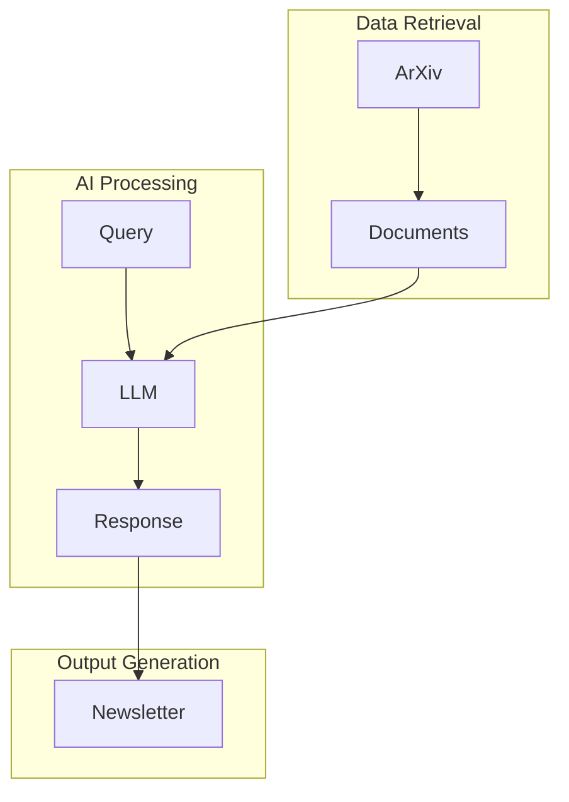

# MedDigest

MedDigest is a tool that automatically collects and processes medical research papers from various open repositories, including arXiv's medical and quantitative biology sections. It extracts key findings, methods, and emerging keywords to help researchers stay up-to-date with the latest developments in medical research.

## Features

- Fetches medical papers from arXiv's API
- Extracts paper metadata including:
  - Title and paper ID
  - Publication date
  - Authors
  - Abstract
  - Full text link
- Processes papers from the last 7 days
- Handles API rate limiting and connection issues
- Provides structured output for further analysis

## Architecture



## Requirements

- Python 3.x
- Required Python packages:
  - requests
  - xml.etree.ElementTree

## Usage

1. Navigate to the project directory:
```bash
cd MedDigest
```

2. Run the script:
```bash
python3 main.py
```

The script will fetch medical papers from the last 7 days and output their abstracts and conclusions.

## Future Enhancements

- Integration with additional medical research repositories
- Advanced text analysis for key findings extraction
- Keyword extraction and trend analysis
- PDF download and processing capabilities
- Web interface for browsing results

## Contributing

Feel free to submit issues and enhancement requests!
